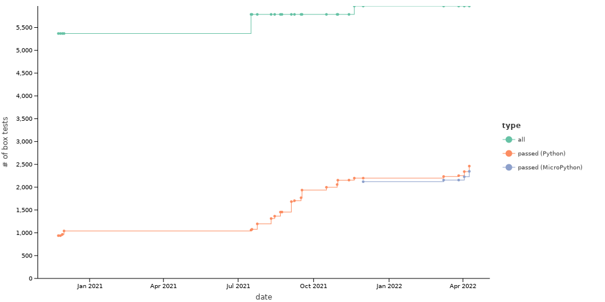

# Python backend

The goal is to have Kotlin-Python interop, starting with being able to compile Kotlin to Python.

Related:

* Slack channels: [#python](https://kotlinlang.slack.com/archives/C01EY9ZF9B5) and [#python-contributors](https://kotlinlang.slack.com/archives/C0289CS37AS)
* YouTrack issue: https://youtrack.jetbrains.com/issue/KT-34074
* discussion at https://discuss.kotlinlang.org/t/idea-python-backend/19852

## How to try

No artifact is available yet so the only way now is to clone the repo and compile everything yourself.

## Development

All the commands should be called from the repository root.

### Compiling the compiler

```shell script
./gradlew dist
```

### Compiling `out_ir.py` from `python.kt`

```shell script
dist/kotlinc/bin/kotlinc-py -libraries dist/kotlinc/lib/kotlin-stdlib-py-js.klib -Xir-produce-py -output python/experiments/generated/out_ir.py python/experiments/python.kt
```

### Generating stats about missing IR mapping

```shell script
less python/experiments/generated/out_ir.py | grep -Po "visit[a-zA-Z0-9_]+" | sort | uniq -c | sort -nr > python/experiments/generated/missing.txt
```

### Compiling `out-ir.js` from `python.kt`

To see how the same code is compiled to JS:

```shell script
dist/kotlinc/bin/kotlinc-js -libraries dist/kotlinc/lib/kotlin-stdlib-js.jar -Xir-produce-js -Xir-property-lazy-initialization -output python/experiments/generated/out-ir.js python/experiments/python.kt
```

### Running fast tests

```shell script
./gradlew :python:ast:test  # Python AST to code tests
python/e2e-tests/run.sh  # e2e tests
```

### Running box tests

```shell script
./gradlew :python:box.tests:pythonTest
# or
./gradlew :python:box.tests:microPythonTest
```

To speed up tests:

```shell script
# create ramdisk where temporary test py files are generated extensively:
# don't forget to activate sudo before copy-pasting: sudo echo
sudo mount -t tmpfs -o size=10G myramdisk python/py.translator/testData
sudo mount -t tmpfs -o size=10G myramdisk1 /tmp

mount | tail -n 2  # check it's mounted successfully
sudo umount python/py.translator/testData  # unmount
sudo umount /tmp  # unmount
```

Setting `maxParallelForks` isn't required anymore since now Gradle parallelism is used.

#### Generating reports

```shell script
JAVA_OPTS="-Xmx1G" python/experiments/generate-box-tests-reports.main.kts --test-task=pythonTest
# or
JAVA_OPTS="-Xmx1G" python/experiments/generate-box-tests-reports.main.kts --test-task=microPythonTest
```

It will generate various reports and summaries:
* `box-tests-report.tsv` - for each test, some useful info are produced, in particular about the reason why it failed
* `failed-tests.txt` - one failed test per line. It provides much less data, but it's still useful because it gives
   a cleaner diff comparing to `box-tests-report.tsv` when something changes. E.g. when the failure reason changes,
   this file won't be affected for a given test - all that matters is that it still fails
* `failure-count.tsv` - aggregated test failure reasons
* `git-history-plot.svg` - a visual history of the number of box tests (passed VS all)

#### Test stats



Current status: **2463**/5970 passed

#### History (newest on top)

* after supporting static fields initialization: **2463**/5970 (+98: +102 passed, +4 failed because no support for unsigned numbers, chars, property delegates, any-to-string conversions)

* after supporting integer multiplication: **2365**/5970 (+23)

* after supporting internal array creation: **2342**/5970 (+29)

* after supporting more reinterpret casts: **2313**/5970 (+47)

* after supporting same-named local variables: **2266**/5970 (+12)

* after partially fixing do-while: **2254**/5970 (+19)

* after supporting function references: **2235**/5970 (+36)

* after updating to Kotlin 1.6.0: **2199**/5970 (incomparable)

* after supporting dynamic expressions (not statements): **2156**/5787 passed (+2)

* after supporting lambda captures: **2154**/5787 passed (+95)

* after supporting complex lambdas (multi-lined; with receiver): **2059**/5787 passed (+60)

* after supporting secondary constructors: **1999**/5787 passed (+47)

* after supporting some type checks: **1952**/5787 passed (+15)

* after supporting extension functions: **1937**/5787 passed (+70: +71 passed, +1 failed because no support for intRange)

* after supporting super classes: **1867**/5787 passed (+98: +99 passed, +1 failed because no support for instanceOf)

* after disabling DCE and PIR compilation: **1769**/5787 passed (+60)

* after supporting const statements: **1709**/5787 passed (+4)

* after supporting set value statements: **1705**/5787 passed (+20)

* after resolving some name clashes: **1685**/5787 passed (+20: +22 passed, +2 failed because no support for default arguments and extension functions, but with clashes those functions were overriden by others and tests passed)

* after adding initial support for static fields: **1665**/5787 passed (+209)

* after changing varargs a bit (due to refactoring expr transformer): **1456**/5787 passed (+1)

* after supporting simple lambdas: **1455**/5787 passed (+89)

* after supporting most integer operations: **1366**/5787 passed (+52)
  
* after supporting float constants: **1314**/5787 passed (+2)

* after supporting do-while, break, continue: **1312**/5787 passed (+14)

* after supporting string concatenation: **1298**/5787 passed (+6)

* after supporting binary ops: **1292**/5787 passed (+87)

* after supporting arrays: **1205**/5787 passed (+8)

* after supporting unary ops: **1197**/5787 passed (+53)

* after supporting return statements: **1144**/5787 passed (+4)

* after supporting when expressions: **1140**/5787 passed (+62)

* after supporting when statements: **1078**/5787 passed (+7)

* after removing empty variable declaration: **1071**/5787 passed (+3)
  
* after supporting comparison: **1068**/5787 passed (+7)

* after updating to Kotlin 1.5.21: **1061**/5787 (incomparable)

* after supporting some constructors, some inheritance...: **1042**/5368 passed (+75)

* after adding support for class methods: **967**/5368 passed (+28)

* with Python interpreter in place, no other changes to the compiler: **939**/5368 passed (+84)

* with no Python interpreter hooked into the tests and
  * when `OK` returned from the interpreter interface: all passed
  * when something else returned from the interpreter interface: **855**/5368 passed
    (the ones that succeeded are `testAllFilesPresentIn...` tests which doesn't depend on the actual invocation of code under test)

### Before commit

Here are all the commands that update autogenerated files. Don't forget to execute them before a commit. Otherwise, the CI will fail as it executes the same commands and checks the equality of the generated files.

```shell script
./gradlew dist

dist/kotlinc/bin/kotlinc-py -libraries dist/kotlinc/lib/kotlin-stdlib-py-js.klib -Xir-produce-py -output python/experiments/generated/out_ir.py python/experiments/python.kt
less python/experiments/generated/out_ir.py | grep -Po "visit[a-zA-Z0-9_]+" | sort | uniq -c | sort -nr > python/experiments/generated/missing.txt

dist/kotlinc/bin/kotlinc-js -libraries dist/kotlinc/lib/kotlin-stdlib-js.jar -Xir-produce-js -Xir-property-lazy-initialization -output python/experiments/generated/out-ir.js python/experiments/python.kt

./gradlew :python:box.tests:pythonTest
./gradlew :python:box.tests:microPythonTest
JAVA_OPTS="-Xmx1G" python/experiments/generate-box-tests-reports.main.kts --test-task=pythonTest
JAVA_OPTS="-Xmx1G" python/experiments/generate-box-tests-reports.main.kts --test-task=microPythonTest
```

Also, you can skip any of the steps but invoke the [`Generate reports` GitHub action](../.github/workflows/generate_reports.yml) manually (see the ["Manually running a workflow" GitHub Documentation](https://docs.github.com/en/actions/managing-workflow-runs/manually-running-a-workflow)). It will generate all the files for the specified branch and commit and push them. Since [generated commits don't trigger `push` workflows](https://docs.github.com/en/actions/learn-github-actions/events-that-trigger-workflows#triggering-new-workflows-using-a-personal-access-token), you will need to also invoke the [`Build and test` GitHub action](../.github/workflows/build_and_test.yml) if you want to make a generated commit green.
